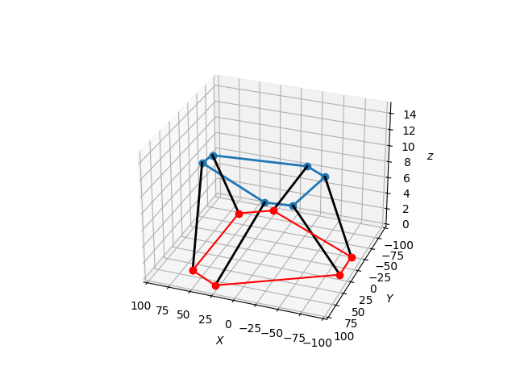

# Stewart Platform Inverse Kinematics Simulation with stochastic JONSWAP waves

https://catlikecoding.com/unity/tutorials/flow/waves/  -- Wave shader

https://www.orcina.com/webhelp/OrcaFlex/Content/html/Vesseltheory,RAOsandphases.htm -- RAO calulation

https://www.orcina.com/webhelp/OrcaFlex/Content/html/Vesseltheory,RAOqualitychecks.htm -- Phase lags

https://www.calqlata.com/productpages/00059-help.html -- RAO as Transfer function

https://www.usna.edu/NAOE/academics/en400.php -- USNA - EN400

https://www.usna.edu/NAOE/academics/en455.php -- USNA - EN455

https://rules.dnv.com/docs/pdf/DNV/CG/2018-01/DNVGL-CG-0130.pdf -- DNVGL 0130

https://www.calqlata.com/productpages/00081-help.html -- RAO calculations
Google searches:

    vessel have to pitch phase shift

https://jakevdp.github.io/blog/2012/08/18/matplotlib-animation-tutorial/ -- Good tutorial for matplotlib animations