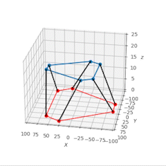
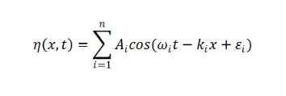
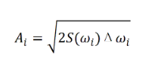
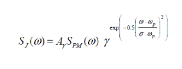
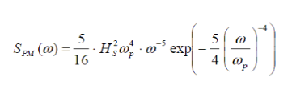

# Stewart Platform Inverse Kinematics Simulation with stochastic JONSWAP waves

    

## Prerequisite
In order to plot and animate the platform simulation points, the Python package **matplotlib** is required.

* Pip install for Python3:

      pip3 install matplotlib

## Running the default simulation

simply execute the file: **main.py**

## Applied theory

#### Wave theory
The wave elevation at time, t, at distance from calculation origin, x, is calculated with the following equations
from **DNVGL-CG-0130**

    

    

    

    

A "raft in slow waves" assumption is made when calculating the 6 degree of freedom body
displacement's amplitudes and phase lags. 

